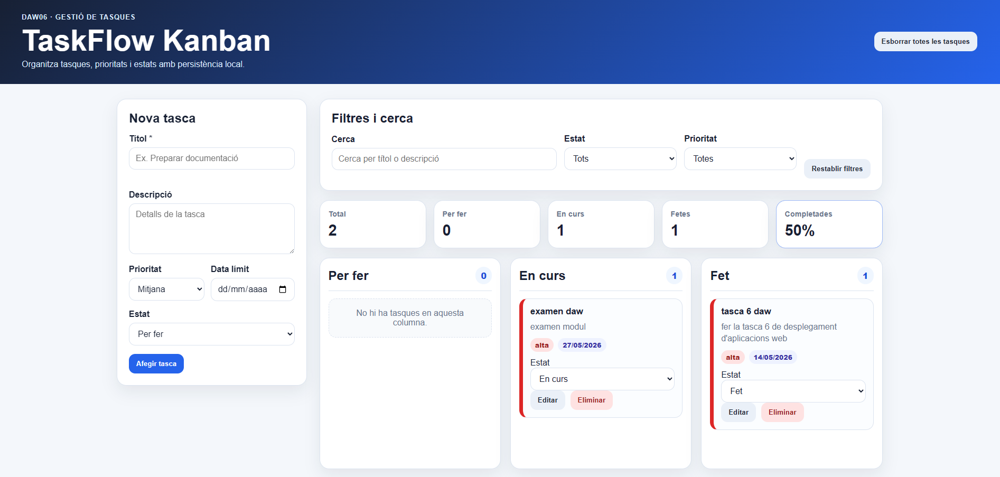
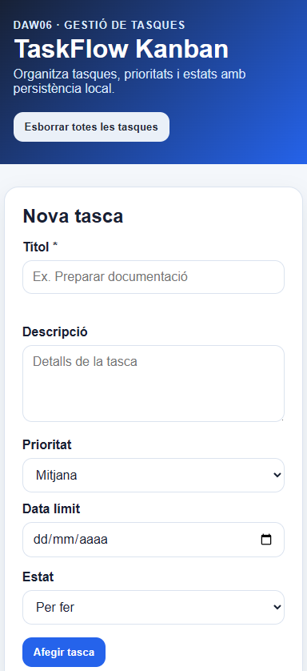

# TaskFlow Kanban

Aplicació web de gestió de tasques tipus Kanban desenvolupada per a la tasca DAW06 amb HTML, CSS i JavaScript.

## Descripció

TaskFlow Kanban permet organitzar tasques en tres columnes d'estat:

- Per fer
- En curs
- Fet

L'aplicació permet crear, editar, eliminar i moure tasques entre columnes. També inclou filtres, cerca de text, estadístiques bàsiques i persistència amb localStorage.

## Funcionalitats principals

- Crear tasques amb títol, descripció, prioritat, data límit i estat.
- Editar tasques existents.
- Eliminar tasques amb confirmació.
- Canviar l'estat d'una tasca amb un desplegable.
- Filtrar per estat.
- Filtrar per prioritat.
- Cercar per títol i descripció.
- Mostrar estadístiques globals:
  - Total de tasques.
  - Tasques per estat.
  - Percentatge de tasques completades.
- Guardar les dades al navegador amb localStorage.
- Disseny responsiu per a ordinador, tauleta i mòbil.

## Guia ràpida d'ús

### Crear una tasca

1. Escriu un títol al formulari.
2. Afegeix una descripció si és necessari.
3. Selecciona la prioritat.
4. Indica una data límit.
5. Selecciona l'estat inicial.
6. Prem el botó **Afegir tasca**.

### Editar una tasca

1. Prem el botó **Editar** d'una tasca.
2. El formulari es preomplirà amb les dades actuals.
3. Modifica les dades.
4. Prem **Guardar canvis**.

### Moure una tasca

Cada targeta té un desplegable d'estat. Canvia'l a:

- Per fer
- En curs
- Fet

La tasca es mourà automàticament a la columna corresponent.

### Filtrar i cercar

A la zona de filtres pots:

- Cercar text dins el títol o la descripció.
- Filtrar per estat.
- Filtrar per prioritat.
- Restablir tots els filtres.

## Estructura del projecte

```text
index.html
README.md
.gitignore
img/
css/estils.css
js/script.js
```

## Tecnologies utilitzades

- HTML5 semàntic
- CSS3
- Flexbox i CSS Grid
- JavaScript
- localStorage
- Git i GitHub
- GitHub Pages

## Enllaços

- Repositori GitHub: https://github.com/jgr31/tasca6-daw-kanban
- GitHub Pages: https://jgr31.github.io/tasca6-daw-kanban/

## Captures de pantalla




